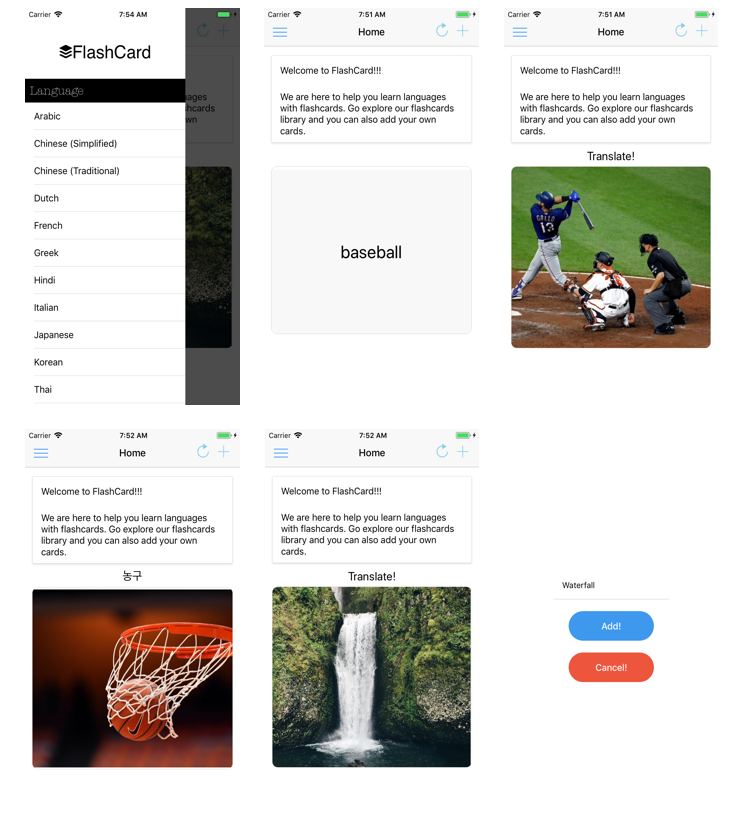

# react-native-flash-card

Newcomers that arrive in countries they have never lived in before, usually are overwhelmed and it is tough for them to manage without knowing the dialect that the country uses. SmartCards will allow users to get over this barrier,  by actively giving them translations and pictures of certain phrases or words the user wants to learn.


## Technologies
This application may not run correctly on Andorid. Waiting for your awesome contribution!
  * Bing Image Search
  * Google Translate
  * React-Native

## USAGE
  * Guess the meaning of the word by swiping the cards to left and right
  * Hints will show up when user clicks the card by showing relevant image
  * Look for translation to match with your knowledge!

## BUILD/INSTALLATION INSTRUCTIONS
```sh
git clone https://github.com/junlee91/react-native-flash-card.git

cd frontend

npm install


cd .. 

cd backend

pip install -r requirements.txt

python database_setup.py

sqlite3 flashcard.db

.read deploy/seed.sql

python app.py


``` 

## Demo
[YouTube Demo](https://youtu.be/QVFjnGwLi9c) 

## Screenshots
[](https://github.com/junlee91/react-native-flash-card/blob/master/screenshot/screenshots.png)

## Try it out
#### Try it with Exponent: https://expo.io/@junlee91/my-flash-card

## License 
MIT License

Copyright (c) Jun, Seho, Alan, Hassan, Anas, Zhiwei

Permission is hereby granted, free of charge, to any person obtaining a copy
of this software and associated documentation files (the "Software"), to deal
in the Software without restriction, including without limitation the rights
to use, copy, modify, merge, publish, distribute, sublicense, and/or sell
copies of the Software, and to permit persons to whom the Software is
furnished to do so, subject to the following conditions:

The above copyright notice and this permission notice shall be included in all
copies or substantial portions of the Software.

THE SOFTWARE IS PROVIDED "AS IS", WITHOUT WARRANTY OF ANY KIND, EXPRESS OR
IMPLIED, INCLUDING BUT NOT LIMITED TO THE WARRANTIES OF MERCHANTABILITY,
FITNESS FOR A PARTICULAR PURPOSE AND NONINFRINGEMENT. IN NO EVENT SHALL THE
AUTHORS OR COPYRIGHT HOLDERS BE LIABLE FOR ANY CLAIM, DAMAGES OR OTHER
LIABILITY, WHETHER IN AN ACTION OF CONTRACT, TORT OR OTHERWISE, ARISING FROM,
OUT OF OR IN CONNECTION WITH THE SOFTWARE OR THE USE OR OTHER DEALINGS IN THE
SOFTWARE.